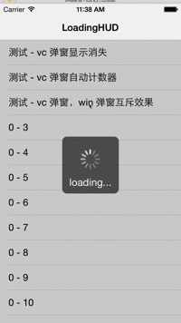

# SwiftLoadingHUD
swift版的hud加载框视图

提供2个级别hud类型

* viewcontroller 级别，每个vc都拥有属于自己的hud
* window 级别，一个遮住所有界面的hud
* win级别hud出现时，自动隐藏vc级别的hud，消失时通知隐藏的hud显示 
* 侵入小，采用 objc_setAssociatedObject 方法在扩展中添加视图属性
* 使用方便，自动管理hud的显示、隐藏计数器，计数器为0则隐藏，便于处理多网络请求时的hud显示管理

--- 
viewcontroller级别显示hud

``` self.ldt_loadingCountAdd() ```

viewcontroller级别隐藏hud

``` self.ldt_loadingCountReduce() ```

--- 
window级别显示hud

``` LoadingTool.show() ```

window级别隐藏hud

``` LoadingTool.dismiss() ```

---
